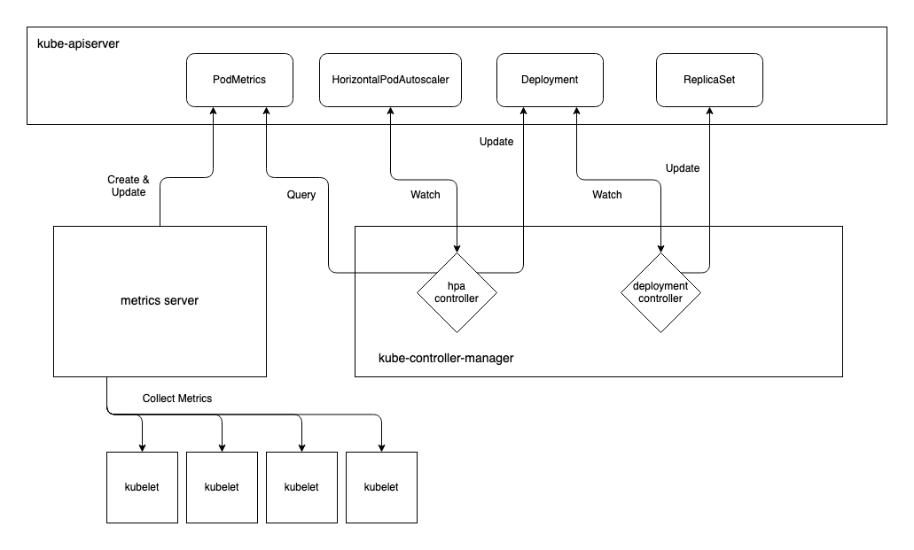
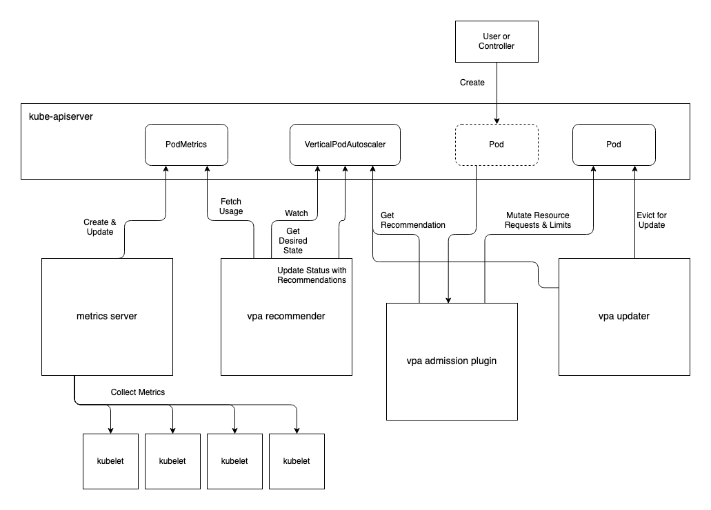
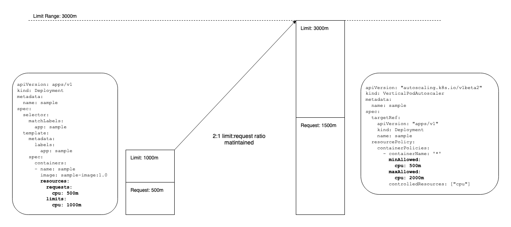
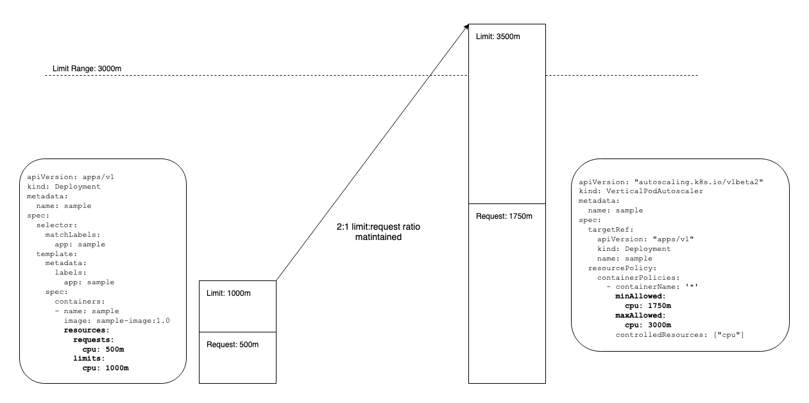
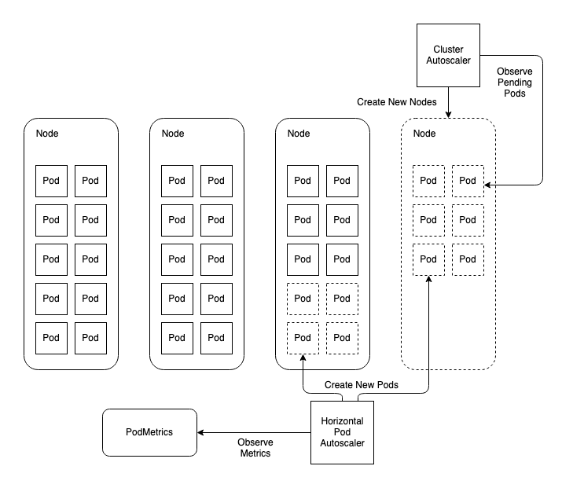
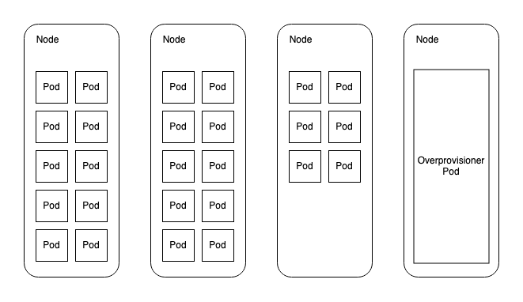

This reference provides guidance, trade-off considerations and implementation
details for autoscaling application workloads and the cluster's compute
resources that host them. It includes a variety of approaches to the practice
of using software to monitor usage and manage capacity for application
workloads.

### Use Cases

If the following conditions are present, autoscaling may be advisable:

- Workloads can readily scale: The architectural nature of the application
  workload lends itself to scaling by:
  - Adding replicated instances
  - Taking advantage of added compute resources
- Compute can scale: In environments such as the public cloud where new compute
  resources can be brought online programmatically, the capacity of the
  underlying infrastructure can be dynamically managed.
- Bursting usage: If the load on your application is prone to sharp increases,
  such as eCommerce workloads, the ability to respond immediately using
  automated systems may be important.
- High utilization needs: If cost management and efficient utilization are
  important for a workload with varying load, using automated scaling mechanisms
  may provide the most cost-effective solution.

Where autoscaling may be less effective or inadvisable:

- Predictable: In the situation where you have predictable load, the underlying
  purpose for autoscaling is absent.
- Utilization is low priority: If high utilization is not a priority and cost
  constraints are not present, you may be better served by sufficiently
  over-provisioning software and hardware resources to accommodate increases in
  load.
- Resource constrained environment: In an environment where you cannot readily
  provision more compute, scaling of workloads may be possible within those
  compute constraints but will have hard limits that cannot be dynamically
  moved.
- Not failure tolerant: autoscaling workloads involves removing or restarting
  application units so if your application does not handle termination signals
  or otherwise handle shut-downs well, it will not be well-suited.

### General Trade-Offs

Pros:

- lower operational toil in managing capacity
- ability to better utilize compute
- dynamic responsiveness to changing load and consumption

Cons:

- added complexity
- potentially unpredictable behavior
- may overspend if not tuned well or capped appropriately

### Horizontal Scaling

Horizontal scaling involves changing the replicated number of instances of
something. In application terms this often is simply increasing and decreasing
app instances. This is feasible for stateless operations where adding identical
replicas to a load-balanced pool can increase capacity or for stateful
applications that are designed to achieve similar capabilities. In
infrastructure terms, it involves adding more virtual or physical machines to
adjust the pool of underlying compute. This is feasible in a Kubernetes-based
platform that can dynamically utilize changes to the pool of worker nodes.

### Vertical Scaling

Vertical scaling refers to changes in the allocated resources for a given unit.
For an application, this means giving it more or less CPU, memory or other
resources in response to actual usage by the workload. Vertical infrastructure
scaling is not covered in this reference since mutating infrastructure is far
less manageable than horizontally scaling the underlying machines.

## Workload Autoscaling

### Horizontal Pod Autoscaling

The Horizontal Pod Autoscaler (HPA) manages the number of replicas of a
workload based on the consumption of some measurable resource. A common example
is to declare a target percentage of CPU request. You declare what the target
usage is for your workload, and the HPA controller will add or remove replicas
based on actual usage compared to that target.

The HPA desired state is defined by the `HorizontalPodAutoscaler` API kind in
the `autoscaling` group. The latest version of the API is `v1` and is the
version addressed in this reference, but versions `v2beta1` and `v2beta2` also
exist. The state is reconciled by a control loop in the kube-controller-manager.

Periodically, the HPA control loop will query the metric used to determine
workload scale. By default, this controller will query the metric every 15
seconds but this can be adjusted with the
`--horizontal-pod-autoscaler-sync-period` flag on the kube-controller-manager.
Using the metric and the desired state defined in the `HorizontalPodAutoscaler`
resource, the desired number of replicas will be calculated and updated on the
target workload as needed. The target may be a ReplicaSet, Deployment or
StatefulSet resource.

#### Resource Metrics

A simple, common method for autoscaling with HPAs is using pod CPU usage. For
workloads that consume more CPU as their load increases, this may be a good
solution. It is _not_ a good solution if, for example, CPU remains relatively
constant but memory consumption grows with increased load.

If using this method, you will need the [Metrics
Server](https://github.com/kubernetes-sigs/metrics-server) deployed in your
cluster. The Metrics Server will collect metrics from the various Nodes'
kubelets and create `metrics.k8s.io/v1beta1/PodMetrics` resources for each
running pod. The HPA controller will use the HorizontalPodAutoscaler to
determine which PodMetrics to query. According to the metrics observed and the
desired state defined in the HPAs, it will update the replicas in the relevant
resource, e.g. Deployment, which will, in turn, alter the number of pods
running.



When using HPAs it is important to understand how your workload is going to
scale in response to changes in resource usage. In the following sample
manifest, the Deployment requests 100m CPU for each pod. Note that `replicas`
are not set on the Deployment spec. Normally this would result in zero replicas
being created, however the HPA is managing the number of replicas and has
`minReplicas` set which will ensure at least one replica is running at all
times. Note also that if CPU resource requests aren't set for the Deployment,
the HPA will have no effect.

```yaml
apiVersion: apps/v1
kind: Deployment
metadata:
  name: sample
spec:
  selector:
    matchLabels:
      app: sample
  template:
    metadata:
      labels:
        app: sample
    spec:
      containers:
        - name: sample
          image: sample-image:1.0
          resources:
            requests:
              cpu: "100m" # must be set
---
apiVersion: autoscaling/v1
kind: HorizontalPodAutoscaler
metadata:
  name: sample
spec:
  scaleTargetRef:
    apiVersion: apps/v1
    kind: Deployment
    name: sample
  minReplicas: 1 # will not scale below this value
  maxReplicas: 3 # will not scale above this value
  targetCPUUtilizationPercentage: 50 # will scale based on this percentage of usage
```

The formula used to determine replica count is:

```
desiredReplicas = ceil( currentReplicas * ( currentMetricValue / desiredMetricValue ) )
```

`desiredReplicas` is the value that will be set on the target resource's
`replicas` when it has changed.

`ceil` is the ceiling function that rounds up to the nearest integer.

`currentReplicas` is the existing replica count on the target resource.

`currentMetricValue` is the aggregate CPU usage for all relevant pods as queried
from the PodMetrics resource for the pods in question.

`desiredMetricValue` is the `targetCPUUtilizationPercentage` of the CPU request
(50% of 100m, in this example) multiplied by the `currentReplicas`

In order to illustrate how the replicas will scale, consider these examples:

1. There is one replica running. The HPA controller queries the PodMetrics for
   that pod and finds the currentMetricValue is 120m.

   ```
   ceil( 1 * (120/50) ) = 3
   ```

   In this case, it will scale the replicas out to the maximum of 3.

2. There is one replica running. The HPA controller queries the PodMetrics for
   that pod and finds the currentMetricValue is 52m.

   ```
   ceil( 1 * (52/50) ) = 2
   ```

   In this case, the recommendation from the formula output will _not_ be used
   since the ratio `52/50` is less than the default tolerance of 0.1. This
   tolerance prevents scaling when the amount of CPU usage change doesn't
   warrant it. This default tolerance can be adjusted with the
   `--horizontal-pod-autoscaler-tolerance` flag on the kube-controller-manager.

3. There are two replicas running. The HPA controller queries the PodMetrics
   for them and finds the currentMetricValues are 15m and 25m (40m combined).

   ```
   ceil( 2 * (40/100) ) = 1
   ```

   In this case, it will scale the replicas in to 1 _if_ a scaledown has been
   the calculated outcome for the last 5 minutes. This 5 minute period prevents
   scaledowns due to temporary drops in metric values. This default
   stabilization period can be adjusted with the
   `--horizontal-pod-autoscaler-downscale-stabilization` flag on the
   kube-controller-manager.

#### Custom Metrics

If the Metrics Server is insufficient in providing metrics there are other
[custom metrics
implementations](https://github.com/kubernetes/metrics/blob/master/IMPLEMENTATIONS.md#custom-metrics-api)
available. Of these, the [Prometheus
Adapter](https://github.com/directxman12/k8s-prometheus-adapter) is the most
generally useful. It is not vendor-specific and leverages a common open-source
metrics solution.

### Vertical Pod Autoscaling

The [vertical pod
autoscaler](https://github.com/kubernetes/autoscaler/tree/master/vertical-pod-autoscaler)
is a community-managed project in the Kubernetes autoscaler repo. Unlike the
HPA, it is not bundled into the kube-controller-manager. It consists of three
distinct components that run in the cluster and uses two custom resources. As
with the HPA, the VPA relies on the Metrics Server to provide CPU and memory
usage metrics.

Components:

- Recommender: recommends CPU and/or memory request values based on observed
  consumption. Fetches metrics once a minute by default which can be adjusted
  with the `--recommender-interval` flag. Is the core component that is active
  in all modes.
- Admission Plugin: sets resource requests on new pods as determined by the
  Recommender. Is active in all modes except the `Off` mode.
- Updater: evicts pods that have requested resources that differ significantly
  from the values determined by the Recommender. Is active in `Recreate` and
  `Auto` modes; dormant in `Off` and `Initial` modes.

CustomResources:

- VerticalPodAutoscaler: the resource where you provide the desired state for
  your vertical autoscaling.
- VerticalPodAutoscalerCheckpoint: used internally by the Recommender to
  checkpoint VPA state. It is used for recovery if the Recommender restarts.



There are different modes the VPA can run in. Technically there are four modes,
but in effect there are just three since two are functionally equivalent at this
time:

- `Off`: The dry-run mode. Recommendations are calculated and can be queried
  using `kubectl describe` for the VPA resource in question, but are never
  applied.

- `Initial`: The safe mode. Recommendations are calculated and can be queried.
  They are applied when new pods are created, but running pods are never evicted
  in order to update them.

- `Recreate`: The active mode. Recommendations are calculated and are applied
  when they differ significantly from the current requested resources. The
  recommendations are applied by evicting the running pods so that the new pod
  gets the recommendations. Only use this mode if your pods can safely be
  evicted and restarted when the VPA determines they should be updated. If
  using this mode, and when availability is important, you should also apply a
  PodDisruptionBudget to ensure _all_ of your pods are not evicted at once.

- `Auto`: Is currently (in v1) equivalent to `Recreate`. May take advantage of
  restart-free updates in future.

The sample manifests below represent a Deployment that will create 4 pods and a
VerticalPodAutoscaler that will vertically scale the pods if resource usage
increases significantly above the CPU or memory requests. The VPA will not
increase requests beyond the `maxAllowed` of 1 CPU and 500Mi memory. If using
the `Recreate` mode, the Updater will evict pods in order to scale them but the
PodDisruptionBudget will ensure that only one pod at a time is evicted.

```yaml
apiVersion: apps/v1
kind: Deployment
metadata:
  name: sample
spec:
  selector:
    matchLabels:
      app: sample
  replicas: 4
  template:
    metadata:
      labels:
        app: sample
    spec:
      containers:
        - name: sample
          image: sample-image:1.0
          resources:
            requests:
              cpu: 100m
              memory: 50Mi
---
apiVersion: "autoscaling.k8s.io/v1beta2"
kind: VerticalPodAutoscaler
metadata:
  name: sample
spec:
  targetRef:
    apiVersion: "apps/v1"
    kind: Deployment
    name: sample
  resourcePolicy:
    containerPolicies:
      - containerName: "*"
        minAllowed:
          cpu: 100m
          memory: 50Mi
        maxAllowed:
          cpu: 1
          memory: 500Mi
        controlledResources: ["cpu", "memory"]
  updatePolicy:
    updateMode: Recreate
---
apiVersion: policy/v1beta1
kind: PodDisruptionBudget
metadata:
  name: sample
spec:
  minAvailable: 3
  selector:
    matchLabels:
      app: sample
```

#### Limit:Request Ratio

The VPA will maintain the limit:request ratio specified in the original pod
template spec. This is important to keep in mind for capacity planning since
the VPA will increase the limits beyond what you specify in the original
deployment spec. The `resourcePolicy` in the VPA below applies to resource
requests. The workload starts with a CPU request of 500m and a limit of 1000m.
The VPA indicates the CPU request may be scaled as high as 1000m. Maintaining
the limit:request ratio in the Deployment template, the VPA Recommender will set
the CPU limit to 2000m if scaled up to the maximum CPU request of 1000m.


#### Limit Range Constraint

The VPA will respect Limit Ranges unless the VPAs resource policy overrides it.
[Limit
Range](https://kubernetes.io/docs/tasks/administer-cluster/manage-resources/cpu-constraint-namespace/)
resources allow cluster admins to set minimum and/or maximum values for resource
consumption in a Namespace. In the following example, the Limit Range will be
respected. The `minAllowed` value in the VPA `resourcePolicy` allows for the
limit:request ratio to be respected without violating the Limit Range. The
`maxAllowed` value of 2000m will not be reached since it will hit the Limit
Range at a request of 1500m due to the limit:request ratio which is set in the
pod spec.



#### Limit Range Override

If, on the other hand, the `minAllowed` value in the VPA `resourcePolicy` causes
the Limit Range to be violated in order to maintain the limit:request ratio set
in the pod spec, the Limit Range will be overridden.



Because this could lead to unintended or unauthorized Limit Range violations,
you should use admission control to prevent this. Two possible ways to achieve
this are:

1. Simple: enforce that the `minAllowed` in the VerticalPodAutoscaler matches
   the resource requests in the pod spec.

2. Complex: have the admission controller fetch the applicable Limit Range,
   calculate the limit:request ratio in the pod spec, calculate the projected
   limit based on the VPA's `minAllowed` value, and check to see if the
   projected limit violates the Limit Range.

### Cluster Proportional Autoscaling

If you have a workload that needs to scale in proportion to the size of the
cluster itself, the
[cluster-proportional-autoscaler](https://github.com/kubernetes-sigs/cluster-proportional-autoscaler)
may be appropriate to use. While it has a narrower use-case and is generally
useful only for cluster services like DNS, it has a very simple operating model
and fewer dependencies.


By default, every 10 seconds, the Cluster Proportional Autoscaler (CPA) will
check the number nodes in the cluster and autoscale the target workload as
needed. The default poll period can be changed using the `--poll-period-seconds`
on the CPA. If you would like to scale a workload based on a subset of nodes you
may use the `--nodelabels` flag on the CPA which will instruct it to count only
those nodes with particular labels. The target workload that will be scaled by
the CPA is defined with the `--target` flag. The scaling parameters to use are
defined in a configmap which is specified by the `--configmap` flag. Because
only one target and configmap may be provided, if you have multiple workloads
for which you would like to use the CPA, you will need to deploy and configure
an instance of the CPA for each.

The replicas are set by either a cores:replicas ratio provided by
`coresPerReplica` _or_ nodes:replicas with `nodesPerReplica`. You can provide
one method or both. If both are given, the larger of the two values will be
applied to the target.

There are two modes to provide scaling parameters. The first example below
denotes the `linear` mode. In this case there will never be less than one
replica, and never more than 100 replicas. Within that range, the
`coresPerReplica` or the `nodesPerReplica` will determine the replicas set on
the target workload. The evaluation that returns the highest value will be used.
In this case, given 20 nodes with 16 cores each, `16 cores * 20 nodes = 320 cores` the `coresPerReplica` will be used which will set 80 replicas on the
target. Alternatively if the nodes have 4 cores each, the `nodesPerReplica` will
produce the higher value of 20 replicas at one node per replica so the target
workload will be set to 20 replicas. In this case
`"includeUnschedulableNodes": true` will exclude non-schedulable nodes that have
been cordoned, for example. Also, `"preventSinglePointFailure": true` will
effectively increase the minimum to 2 if there are multiple nodes.

```
data:
  linear: |-
    {
      "coresPerReplica": 4,
      "nodesPerReplica": 1,
      "min": 1,
      "max": 100,
      "preventSinglePointFailure": true
      "includeUnschedulableNodes": true
    }
```

The other mode is the `ladder` mode which allows for a stepping function that
provides for more granular control. Re-using the example of 20 nodes with 16
cores each, 320 cores would result in 3 replicas due to `[ 64, 3 ]`. If the
nodes increase to 40, 640 cores passes the 512 threshold so `[ 512, 5 ]` would
cause 5 replicas to be set on the target.

```
data:
  ladder: |-
    {
      "coresToReplicas":
      [
        [ 1, 1 ],
        [ 64, 3 ],
        [ 512, 5 ],
        [ 1024, 7 ],
        [ 2048, 10 ],
        [ 4096, 15 ]
      ],
    }
```

In this `ladder` mode example, a 40 node cluster would lead to 5 replicas on the
target. If the node count increases above 64, the replicas will be increased to 6.

```
data:
  ladder: |-
    {

      "nodesToReplicas":
      [
        [ 1, 1 ],
        [ 4, 2 ],
        [ 8, 3 ],
        [ 16, 4 ],
        [ 32, 5 ],
        [ 64, 6 ]
      ]
    }
```

## Cluster Autoscaling

When horizontally autoscaling applications, as the workload pod replicas
increase, it may run out of worker nodes to run on. Scaling the cluster around
the workload solves this problem. Using [Cluster
Autoscaler](https://github.com/kubernetes/autoscaler/tree/master/cluster-autoscaler)
(CA) you can ensure your worker node pool will increase in response to pods
being unschedulable due to a lack of worker nodes.

In the following example diagram, the HPA queries metrics and determines the
replica count needs to be scaled from 26 to 36. This exceeds the capacity of the
cluster's worker nodes which is 30. That leaves 6 pods in a Pending state. They
are unschedulable due to a lack of compute available. The CA observes this
condition and determines that one more worker node will satisfy the shortage of
node resources and provisions a new node using the underlying infrastructure
provider. The workload pods will remain Pending until the node joins the cluster
and at that time they will be scheduled to the new node satisfying the
workload's scaling requirements.



#### Provider Support

At this time, Cluster Autoscaler supports the following cloud providers:

- [Google Compute Engine](https://cloud.google.com/compute/)
- [Google Kubernetes Engine](https://cloud.google.com/kubernetes-engine/)
- [Amazon Web Services](https://aws.amazon.com/)
- [Microsoft Azure](https://azure.microsoft.com/en-us/)
- [Alibaba Cloud](https://us.alibabacloud.com/)
- [OpenStack Magnum](https://wiki.openstack.org/wiki/Magnum)
- [Digital Ocean](https://www.digitalocean.com/)
- [Cluster API](https://cluster-api.sigs.k8s.io/)

Note: Cluster Autoscaler uses specific resource types in the infrastructure
provider that will need to be in use in order to leverage CA. If your cluster
infra management does not use these resource types, you will not be able to
leverage CA. For example:

- Amazon Web Services: Autoscaling Groups (ASGs) are used for scaling worker
  nodes in AWS. So if you leverage ASGs to manage your worker node pool, CA may
  be a viable option. On the other hand, if you are provisioning individual EC2
  instances for worker nodes, CA will not work.
- Azure: Virtual Machine Scale Sets (VMSS) are used in Azure. So in order to use
  CA in a cluster running in Azure, you'll need to use VMSS to manage your node
  pools.

An important consideration when deploying Cluster Autoscaler is ensuring it does
not get evicted or that the node it's running on does not get decommissioned
during a scaling event. Consider:

- Run on Master Node: When using CA, worker nodes may be decommissioned to scale
  in. Running the CA itself on a master node solves this potential problem.
- Run in `kube-system`: CA doesn't decommission nodes with non-mirrored
  `kube-system` pods running on them.
- Use a Priority Class: Set `priorityClassName: system-cluster-critical` on the
  CA to prevent eviction.

#### Cluster API

Cluster API extends the Kubernetes API to manage clusters' underlying
infrastructure using Kubernetes controllers. This has relevance to CA since the
autoscaler needs to implement controls over a subset of cluster infrastructure
as well. A [Cluster API
provider](https://github.com/kubernetes/autoscaler/tree/master/cluster-autoscaler/cloudprovider/clusterapi)
was recently added to CA. It is different to the other providers in that Cluster
API is an abstraction of the cloud provider rather than an actual provider. Note
that there are currently important limitations that should be understood. For
example, CA only supports using Cluster API when the cluster used serves as the
both management and workload cluster.

#### Node Scaling

The CA will check for unschedulable pods every 10 seconds by default. This value
can be altered with the `--scan-interval` flag on the CA. If it finds
unschedulable pods, it will calculate how many nodes of the kind in the relevant
node group will be required to satisfy the Pending pods. Then it will increase
the node group by that amount.

The node groups are configured with the `--nodes` flag. The configuration is
provided in the form of `[node minimum count]:[node maximum count]:[node group name]`. The node group name will match the name of the autoscaling resource
(e.g. autoscaling group in AWS or VMSS in Azure). So in the following example,
two node groups will be managed. The `worker-asg-1` node group will not be
scaled higher than 10 or lower than 1. The `worker-asg-2` will be kept between 1
and 3 nodes.

```
--nodes=1:10:worker-asg-1
--nodes=1:3:worker-asg-2
```

When using multiple node groups. the expander will determine which of the node
groups is scaled. If using a single node group, the expander is irrelevant.
Supply the `--expander` flag to denote the expander you need to use. The
available expanders are:

- `random` - The node group will be selected at random. This is the default and
  is not very useful. If using multiple node groups, use a more useful expander.

- `most-pods` - The node group that will allow for the most pods to be
  scheduled. For example, if the unschedulable pods use `nodeSelector` this
  expander will scale the node group that will allow for the pods to be
  scheduled.

- `least-waste` - Will scale the node group that is the best fit for the
  unschedulable pods and will have the least idle resources once provisioned and
  the pods scheduled.

- `price` - Chooses the most effective option. Currently only compatible with
  GCE and GKE providers.

- `priority` - Uses a priority configuration supplied as a configmap which must
  be named `cluster-autoscaler-priority-expander` and run in the same namespace
  as the CA. The configmap is watched by the CA and can be dynamically updated.
  The CA will load configuration changes on the fly. The following example
  includes three priority groups. Each group accepts a list of regular
  expressions. The group with the highest value with a match is used. In the
  following example, if there is a m4.4xlarge node group, it will be used and is
  the most preferred. Failing that, the t2.large or t3.large nodes will be used.
  If no node group name matches any of these, the lowest priority is _any_ other
  group.
  ```
  apiVersion: v1
  kind: ConfigMap
  metadata:
    name: cluster-autoscaler-priority-expander
    namespace: kube-system
  data:
    priorities: |-
      1:
        - .*
      10:
        - .*t2\.large.*
        - .*t3\.large.*
      50:
      - .*m4\.4xlarge.*
  ```

When Cluster Autoscaler finds nodes that have been under-utilized for a
significant amount of time, the CA will remove that node. Nodes that are removed
are deleted in the underlying infra. Deleting the Node resource in Kubernetes is
the responsibility of the node controller in the cloud-controller-manager. If
there are high-priority workloads that you do not want the CA to remove nodes
for, use disruption budgets or annotations to protect them. You can use the
annotation `"cluster-autoscaler.kubernetes.io/scale-down-disabled": "true"` on a
Node and then use `nodeSelector` to assign workloads to those protected nodes.

Because the CA performs calculations to determine the number of new nodes to
provision when adding nodes, and because the operation can be time-sensitive,
request a full core of CPU for CA so it has sufficient compute capacity reserved
and can perform calculations quickly. Also note that using pod affinity and
anti-affinity can have a significant performance impact on the CA, especially in
larger clusters, so if using in conjunction with CA, do appropriate testing to
ensure CA will meet your service level objectives.

### Cluster Overprovisioning

One concern that should be considered when using CA is that, since it is
triggered by Pending pods, it will only begin scaling the number of Nodes when
you are out of capacity. This means you will be out of capacity for the amount
of time it takes for the following to happen:

1. CA recognizes the cluster is out of capacity and calls the infra provider to
   provision more worker nodes
2. The new machines boot up
3. The new machines join the Kubernetes cluster

If this process is relatively short and you build in sufficient headroom to your
workload autoscaling, i.e. you scale the number pods well before the workload is
at full capacity, this may not be a problem. However, if you do find that
cluster scaling cannot meet the demands of a rapidly scaling application,
cluster overprovisioning may be a useful solution.

Cluster overprovisioning involves using a placeholder workload with a
PriorityClass lower than that used by the autoscaling workloads. The placeholder
workload does nothing but request enough resources to trigger the CA to add
standby worker nodes. To extend the cluster autoscaling example used above, this
diagram shows a workload with 26 replicas. Additionally, the overprovisioner is
holding an additional node on standby for scaling events.



Now, when the HPA scales the replicas for the workload to 36, there is a node
ready to accept new pods immediately. Provided the workload pods use a higher
PriorityClass than the overprovisioner, the overprovisioner pod will be evicted
to make way for the 6 pods that couldn't otherwise be scheduled elsewhere in the
cluster. Meanwhile, the overprovisioner will fall into a Pending state which
will trigger the CA to provision a new standby node for the overprovisioner to
live.


There is a [helm
chart](https://github.com/helm/charts/tree/master/stable/cluster-overprovisioner)
that can be used to deploy the overprovisioner, but these sample manifests
demonstrate the principle:

First you need to create a PriorityClass for your autoscaling workloads. If you
are already using PriorityClasses, you need only ensure the overprovisioner's
PriorityClass value is lower. If you're not using PriorityClasses, create a
default that will be used if one is not specified:

```yaml
apiVersion: scheduling.k8s.io/v1
kind: PriorityClass
metadata:
  name: default
value: 0
globalDefault: true
description: "This priority class will be used by all pods that do not specify one."
```

Next create a PriorityClass for your overprovisioner. This priority class will
work provided you have not altered the CA's default priority cutoff of -10. If
you set the `--expendable-pods-priority-cutoff` flag to 0, for example, the CA
will not provision standby nodes for the overprovisioner using a PriorityClass
of -1.

```yaml
apiVersion: scheduling.k8s.io/v1
kind: PriorityClass
metadata:
  name: overprovisioner
value: -1
globalDefault: false
description: "This priority class will be used the overprovisioner to create standby worker nodes."
```

Now Create a deployment that acts as the placeholder workload:

```yaml
apiVersion: apps/v1
kind: Deployment
metadata:
  name: overprovisioner
spec:
  strategy:
    type: Recreate
  replicas: 3 # helps determine standby nodes
  selector:
    matchLabels:
      app: overprovisioner
  template:
    metadata:
      labels:
        app: overprovisioner
    spec:
      priorityClassName: overprovisioner # specifies priority class
      containers:
        - name: overprovisioner
          image: k8s.gcr.io/pause:3.1 # workload consumes no resources
      resources:
        requests:
          cpu: 31 # helps determine standby nodes
```

An important consideration with this strategy is the relationship between this
deployment's CPU requests, replicas and the standby nodes it creates. In this
example we have asked for 3 replicas that request 31 CPU each. In a cluster that
uses 32 core worker nodes, the objective is for the CA to provision 3 standby
nodes. It is generally not going to work to request _all_ CPU for the node. If
there are any DaemonSet pods that request resources, the overprovisioner will
not get scheduled at all. So, determine the aggregate CPU request for the pods
that _every_ node runs such as your CNI provider pod, kube-proxy, and any other
DaemonSets. Then set the CPU requests for your overprovisioner to just below
that. If you set it too low, workloads will be provisioned alongside the
overprovisioner and you will not get new standby nodes added to the cluster when
you otherwise might expect to.

This system has the benefit that you can scale the number of replicas for the
overprovisioner and get a corresponding number of standby nodes. It has the
disadvantage that if you add DaemonSets without adjusting the overprovisioner
CPU request, or if you adjust the number of cores for your worker nodes, your
overprovisioner may stop working as expected.